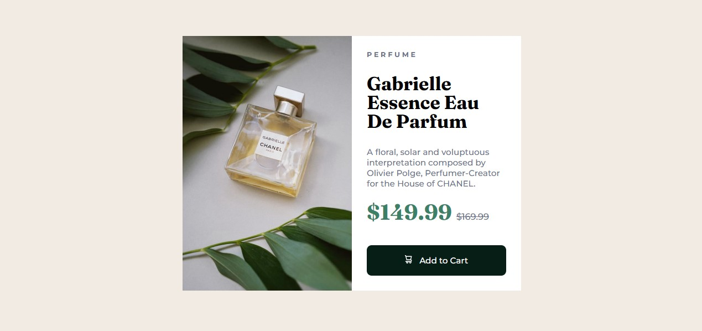
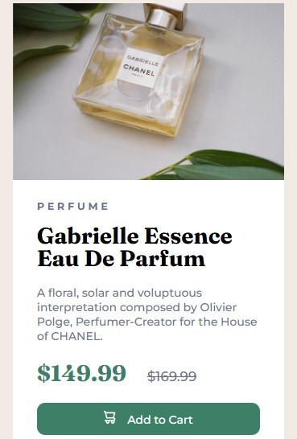

# Frontend Mentor - Product preview card component solution

This is a solution to the [Product preview card component challenge on Frontend Mentor](https://www.frontendmentor.io/challenges/product-preview-card-component-GO7UmttRfa). Frontend Mentor challenges help you improve your coding skills by building realistic projects. 

## Table of contents

- [Overview](#overview)
  - [The challenge](#the-challenge)
  - [Screenshot](#screenshot)
  - [Links](#links)
- [My process](#my-process)
  - [Built with](#built-with)
  - [What I learned](#what-i-learned)
- [Author](#author)
- [Acknowledgments](#acknowledgments)

**Note: Delete this note and update the table of contents based on what sections you keep.**

## Overview

### The challenge

Users should be able to:

- View the optimal layout depending on their device's screen size
- See hover and focus states for interactive elements

### Screenshot






### Links

- Solution URL: [See solution URL here](https://www.frontendmentor.io/solutions/responsive-product-card-component-0-BduaLdzo)
- Live Site URL: [See live site URL here](https://kiviekelvin.github.io/product-preview-card-component-main/)

### Built with

- Semantic HTML5 markup
- CSS custom properties
- Flexbox
- CSS Grid
- Mobile-first workflow

### What I learned

```html
<link rel="stylesheet" href="main.css">
<link rel="preconnect" href="https://fonts.googleapis.com">
<link rel="preconnect" href="https://fonts.gstatic.com" crossorigin>
<link href="https://fonts.googleapis.com/css2?family=Montserrat:ital,wght@0,100..900;1,100..900&display=swap" rel="stylesheet">
<link rel="preconnect" href="https://fonts.googleapis.com">
<link rel="preconnect" href="https://fonts.gstatic.com" crossorigin>
<link href="https://fonts.googleapis.com/css2?family=Fraunces:ital,opsz,wght@0,9..144,100..900;1,9..144,100..900&display=swap" rel="stylesheet">
<link rel="icon" type="image/png" sizes="32x32" href="./images/favicon-32x32.png">
<title> Product Review Card </title>
```


```css
.proud-of-this-css {
  .container {
    display: grid;
    grid-template-rows: repeat(2, 100%);
    grid-template-columns: repeat(auto-fit, minmax(100px, 1fr));
    width: 45%;
    margin: 0;   
}

@media (max-width: 550px) {
    .container {
        grid-template-columns: 1fr;
        grid-template-rows: 40% 60%;
        width: 90vw;
        height: 100vh;
        margin-top: 30px;
    }
}
}
```


## Author

- Website - [Kelvin Ahante](https://www.kelvinahante.com)
- Frontend Mentor - [@kiviekelvin](https://www.frontendmentor.io/profile/kiviekelvin)
- Twitter - [@D1Mysticity](https://x.com/D1Mysticity)


## Acknowledgments

My Tutors - David and Godwim
